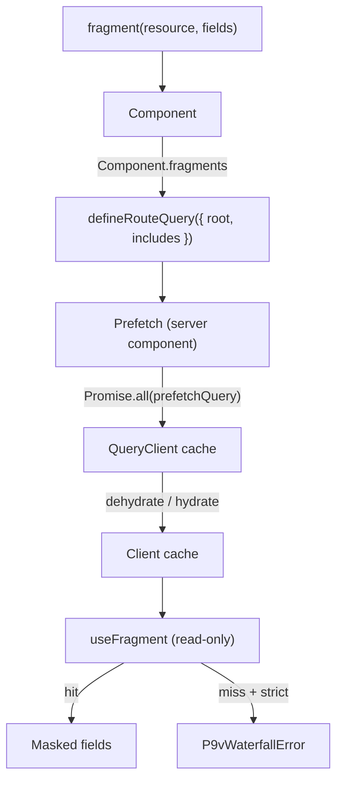

# p9v

[English](./README.md) | 한국어

**Prefetch → View.** REST와 [TanStack Query](https://tanstack.com/query)를 위한 Relay 스타일 데이터 레이어로, 선언된 라우트에서 요청 워터폴(Waterfall)이 다시 생기지 않도록 막아 줍니다.

컴포넌트는 필요한 필드를 스스로 선언합니다. `includes`에 선언된 컴포넌트의 리소스가 라우트 `root`에서 빠지면 타입 오류와 개발 환경 검증 오류가 발생합니다. 같은 리소스라도 실제 query key의 데이터가 없다면 `useFragment`가 명확한 워터폴 오류로 드러냅니다.

```tsx
// 1. Define a resource once
export const userResource = defineResource({
  name: "user",
  key: (id: string) => ["user", id] as const,
  fetch: (id) => api.get<User>(`/users/${id}`),
});

// 2. A component declares exactly what it needs (colocated)
const UserCard_user = fragment(userResource, ["id", "name", "avatarUrl"]);

function UserCard({ userId }: { userId: string }) {
  const user = useFragment(UserCard_user, userId);
  //    ^? { id: string; name: string; avatarUrl: string }
  return <div>{user.name}</div>; // reading user.email is a type error
}
UserCard.fragments = [UserCard_user] as const;

// 3. The route prefetches everything in parallel
export const userPageQuery = defineRouteQuery({
  name: "user-page",
  root: (p: { id: string }) => [userResource(p.id), statsResource(p.id)],
  includes: [UserCard, StatsPanel],
});

// app/users/[id]/page.tsx
export default async function Page({ params }) {
  const { id } = await params;
  return (
    <Prefetch query={userPageQuery} params={{ id }}>
      <UserCard userId={id} />
      <StatsPanel userId={id} />
    </Prefetch>
  );
}
```

## 왜 만들었나?

### 문제점

Next.js App Router + React Query 환경에서 UI를 작성하는 가장 자연스러운 방식은 각 컴포넌트가 필요한 데이터를 직접 요청하는 것입니다. 데이터 요구사항을 컴포넌트와 함께 위치(Colocation)시킬 수 있어 코드 응집도가 올라가기 때문입니다.

하지만 이 방식은 컴포넌트 트리의 깊이만큼 네트워크 요청을 직렬화시킵니다. 부모가 렌더링을 마치고 기다린 후에야 자식이 렌더링을 시작하고 또 기다리는 과정이 반복됩니다.

결국 코드 응집도(유지보수성)와 병렬 프리페치(성능)가 충돌합니다. 모든 자식 컴포넌트의 데이터 요구사항을 라우트 상단에 일일이 중복 선언하며 싱크가 깨지는 것을 감수하거나, 워터폴 현상을 그냥 방치해야 했습니다.

### TanStack Query 메인테이너들도 인정한 한계

TanStack Query 메인테이너들은 이 문제를 [discussion #8064](https://github.com/TanStack/query/discussions/8064)에서 정확히 짚었습니다.

> "프리페칭에서 발생하는 가장 큰 문제는 코드의 파편화(code-dislocation)입니다. [...] Relay 같은 컴파일러 없이는 데이터 요구사항을 추출해 다른 곳에서 자동으로 프리페치를 실행하도록 만드는 것이 불가능합니다."

### "경고"만으로는 부족한 이유

기존 도구들은 워터폴이 발생한 뒤에 이를 탐지합니다. 타이밍 휴리스틱이나 네트워크 레이어를 몽키패치(Monkey patch)하는 방식은 요청이 나가는 순간을 감지할 뿐, 컴포넌트 트리의 구조를 이해하지는 못합니다.

따라서 워터폴이 일어났다는 사실만 알려줄 뿐, 추후 누군가 컴포넌트를 리팩터링할 때 워터폴이 다시 발생하는 것을 구조적으로 막지 못합니다. 탐지 기능만으로는 변화하는 코드베이스를 지켜낼 수 없습니다.

| 도구 | 접근 방식 | 결과 |
| --- | --- | --- |
| `@bam.tech/tanstack-query-detect-waterfall` | 타이밍 휴리스틱 | 경고 (2024년부터 유지보수 중단) |
| `@fluxiapi/scan` | 네트워크 레이어 몽키패치 | 경고, 컴포넌트 트리를 인지하지 못함 |
| **p9v** | fragment + prefetch 강제 | **원천 차단** — 워터폴 발생 시 타입/런타임 에러 발생 |

### 선택한 해법

Relay는 수년 전 GraphQL 생태계에서 이 문제를 이미 해결했습니다. 데이터를 마법처럼 끌어올린 것이 아니라, 타입 시스템으로 엄격한 규칙을 강제했기 때문입니다. 컴포넌트는 자신이 선언한 필드만 접근할 수 있고, 부모는 자식의 fragment를 포함하지 않으면 자식을 렌더링할 수 없도록 만들었습니다.

p9v는 그 동일한 규율(declare / mask / enforce)을 GraphQL, 빌드 단계, 코드 생성(Codegen) 없이 REST + React Query 환경으로 이식합니다. 그 체감 효과는 확실합니다. 예제 앱 기준으로 동일한 화면에서 중첩 워터폴을 병렬 프리페치로 전환하는 것만으로 1202ms에서 401ms로 3배(801ms 절감) 향상됩니다.

## 세 가지 규칙

1. **Declare(선언)** — 컴포넌트는 `fragment(resource, [...])`를 통해 필요한 필드를 명시적으로 선언합니다.
2. **Mask(마스킹)** — 선언한 필드에만 접근할 수 있습니다. fragment에서 필드를 삭제하면, 해당 필드를 암묵적으로 사용하던 코드에서 즉시 에러가 발생합니다. 타입 레벨은 `Pick`으로, 개발 환경 런타임은 `Proxy`로 엄격히 제한합니다.
3. **Enforce(강제)** — 라우트 정의 시 fragment 리소스 포함 여부를 검사하고, strict 모드의 `useFragment`는 프리페치된 캐시만 읽습니다. 개발 환경에서 정확한 query key의 캐시 미스가 발생하면 React 19.1의 owner stack을 활용해 문제가 발생한 컴포넌트 이름을 포함한 `P9vWaterfallError`를 던집니다. 의도적인 워터폴이 필요한 경우 `{ defer: true }` 옵션으로 선택할 수 있습니다.

개발 환경에서는 데이터가 라우트 단계에서 병렬로 프리페치되어 있거나 명확한 오류가 발생합니다. 프로덕션 non-strict 모드는 서비스 안정성을 위해 기존 fetch fallback을 유지합니다.

## 동작 방식



`<Prefetch>`는 서버에서 실행되어 라우트의 root 리소스를 병렬로 가져오고, 캐시를 직렬화(dehydrate)하여 클라이언트로 전달합니다. 클라이언트의 `useFragment`는 이 캐시를 오직 읽기 전용으로만 참조합니다. 캐시 히트 시 선언된 필드에 대해 마스킹된 뷰를 반환하고, strict 모드에서 캐시 미스가 발생하면 조용히 새 요청을 시작하는 대신 에러를 발생시킵니다.

## 결과

예제 앱은 동일한 화면(user + stats + posts, 엔드포인트마다 400ms)을 두 가지 방식으로 렌더링한 결과입니다.

```text
vanilla (nested waterfall)   1202 ms
p9v (parallel prefetch)       401 ms

→ p9v가 3.00배 더 빠름 (801ms 절감)
```

## 설치

```bash
npm install @p9v/core @tanstack/react-query
```

`react ^18 || ^19` 및 `@tanstack/react-query ^5` 환경을 지원합니다. 워터폴 에러 발생 시 컴포넌트 이름을 정확히 추적하는 기능은 React 19.1+의 owner stack(개발 환경 전용)을 활용합니다. 이전 버전의 React에서도 컴포넌트 이름 표시만 제외되고 동일하게 정상 작동합니다.

## 시작하기

### 1. 리소스 정의

서버 데이터 타입을 한 곳에서 한 번만 정의합니다.

```ts
import { defineResource } from "@p9v/core";

export const userResource = defineResource({
  name: "user",
  key: (id: string) => ["user", id] as const,
  fetch: (id) => api.get<User>(`/users/${id}`),
});
```

리소스 이름은 애플리케이션 안에서 고유해야 합니다. p9v는 이 이름을 문자열 리터럴 타입으로 보존해 fragment 요구사항과 route prefetch를 연결합니다.

### 2. fragment 콜로케이션

각 컴포넌트에서 실제로 사용할 필드만 선언합니다.

```tsx
import { fragment } from "@p9v/core";
import { useFragment } from "@p9v/core/react";

const UserCard_user = fragment(userResource, ["id", "name", "avatarUrl"]);

export function UserCard({ userId }: { userId: string }) {
  const user = useFragment(UserCard_user, userId);
  return <span>{user.name}</span>;
}
UserCard.fragments = [UserCard_user] as const;
```

### 3. 라우트 쿼리 선언

라우트 단위에서 병렬로 프리페치할 리소스들을 지정합니다.

```ts
import { defineRouteQuery } from "@p9v/core";

export const userPageQuery = defineRouteQuery({
  name: "user-page",
  root: (p: { id: string }) => [userResource(p.id), statsResource(p.id)],
  includes: [UserCard, StatsPanel],
});
```

`includes`에 나열한 컴포넌트의 fragment 리소스가 `root`에 없으면 TypeScript 오류가 발생합니다. 개발 환경의 `<Prefetch>`도 JavaScript나 `any`로 작성된 구성에서 같은 누락을 다시 검사합니다.

### 4. 라우트에서 프리페치

서버 컴포넌트가 반복적인 프리페치 처리 로직을 대신 담당해 줍니다.

```tsx
import { Prefetch } from "@p9v/core/server";

export default async function Page({ params }) {
  const { id } = await params;
  return (
    <Prefetch query={userPageQuery} params={{ id }}>
      <UserCard userId={id} />
      <StatsPanel userId={id} />
    </Prefetch>
  );
}
```

## 진입점(Entry points)

| Import         | 실행 환경                   | 내용                                                                                                                                    |
| -------------- | --------------------------- | --------------------------------------------------------------------------------------------------------------------------------------- |
| `@p9v/core`          | 서버 안전(server-safe)      | `defineResource`, `fragment`, `defineRouteQuery`, `P9vRouteConfigError`, `P9vWaterfallError`, 타입 정의 |
| `@p9v/core/react`    | 클라이언트 (`"use client"`) | `useFragment`, `P9vProvider`, `RouteQueryProvider`                                              |
| `@p9v/core/server`   | 서버                        | `<Prefetch>`, `getServerQueryClient`                                                            |
| `@p9v/core/devtools` | 모든 환경                   | `WaterfallRecorder`, `analyzeTimings`, `formatReport`                                           |
| `@p9v/core/devtools/react` | 클라이언트             | 브라우저용 `<P9vDevtools>` 패널                                                               |

React Server Component(RSC)가 클라이언트 전용 코드(`createContext`, Custom Hook 등)를 서버 컴포넌트 그래프로 끌어들이지 않고도 `@p9v/core`를 import할 수 있도록 진입점이 분리되어 있습니다.

## 기존 코드베이스 진단

브라우저 Devtools를 `QueryClientProvider` 안에 한 번 추가합니다.

```tsx
import { P9vDevtools } from "@p9v/core/devtools/react";

<QueryClientProvider client={queryClient}>
  <P9vDevtools />
  {children}
</QueryClientProvider>;
```

플로팅 패널은 p9v `<Prefetch>`의 서버 resource와 브라우저 TanStack Query 요청을 별도 세션으로 표시합니다. 의심되는 critical path, 실제 시간과 병렬화 예상 시간, query key, CLI 호환 JSON을 확인할 수 있습니다. p9v를 거치지 않는 일반 RSC `fetch`는 측정 범위에 포함되지 않습니다.

패널과 서버 timing 수집은 개발 환경에서만 기본 활성화됩니다. 명시적으로 승인된 프로덕션 진단에서는 양쪽을 모두 켜야 합니다.

```tsx
<Prefetch query={pageQuery} params={params} devtools>
  {children}
</Prefetch>

<P9vDevtools enabled />
```

직접 만든 통합에는 기존 headless recorder를 사용할 수 있습니다. 단순 네트워크 탭 기반 측정 도구와 달리 `WaterfallRecorder`는 React Query의 쿼리 캐시에 직접 바인딩되어 단순 URL이 아닌 쿼리(Key, Resource) 단위로 워터폴을 분석합니다.

```ts
import { WaterfallRecorder } from "@p9v/core/devtools";

const recorder = new WaterfallRecorder(queryClient).start();
// ... 페이지를 조작한 후, 측정 결과를 저장하거나 출력합니다.
// recorder.toJSON() -> p9v.record.json 으로 저장
// recorder.format() -> 콘솔에 인라인 출력
```

```bash
npx p9v analyze # ./p9v.record.json 분석 실행
```

```text
[p9v] Waterfall detected — depth 2 (critical path marked ▶)
      observed 720ms  →  ~410ms if parallelized

▶ UserCard · user            █████████████████ 300ms
▶ UserPosts · team                            ███████████████████████ 410ms
```

`p9v analyze` 실행 시 워터폴이 탐지되면(depth > 1) 0이 아닌 Exit Code를 반환하므로 CI 파이프라인의 차단 단계를 구성하기에 유용합니다. 옵션 없이 `p9v`를 실행하면 상세한 사용법을 볼 수 있습니다.

## API Reference

### `defineResource({ name, key, fetch, staleTime?, gcTime? })`

서버 데이터 리소스를 정의합니다.

- `userResource(id)`: 프리페치 가능한 인스턴스를 반환합니다.
- `userResource.queryOptions(id)`: TanStack Query의 `FetchQueryOptions` 객체를 반환합니다.

### `fragment(resource, fields, { name?, defer? })`

컴포넌트가 사용할 필드를 선언합니다. `{ defer: true }`를 설정하면 의도적인 워터폴을 허용합니다. 에러를 던지는 대신 `useFragment`가 데이터를 페칭하고 Suspense 상태로 진입합니다.

### `useFragment(fragment, arg)` — `@p9v/core/react`에서 제공

캐시에서 마스킹된 선언 필드를 참조합니다. 반응형으로 동작하며(캐시 업데이트 시 리렌더링), strict 모드에서는 스스로 네트워크 페칭을 수행하지 않습니다. 캐시 미스 발생 시 다음과 같이 처리됩니다.

- deferred fragment → 데이터를 페칭하며 Suspense를 일으킵니다(의도된 워터폴).
- strict 모드(개발 환경 기본값) → 문제가 발생한 컴포넌트 이름과 함께 `P9vWaterfallError`를 던집니다.
- non-strict(프로덕션 기본값) → 안전한 Fallback으로 데이터를 페칭하며 Suspense를 일으킵니다.

### `defineRouteQuery({ root, includes?, name? })`

`root(params)`는 프리페치할 리소스 인스턴스들의 병렬 집합을 정의합니다. `includes`는 검사 및 devtools 추적을 위해 라우트에 포함될 컴포넌트 목록을 나열합니다. TypeScript는 `includes`의 fragment 리소스가 `root`에 모두 포함되는지 검사합니다.

### `<Prefetch query params>` — `@p9v/core/server`에서 제공

root 리소스를 병렬로 프리페치하고 직렬화(dehydrate)하여 클라이언트에 주입하는 서버 컴포넌트입니다. `getQueryClient`, `Promise.all(prefetchQuery)`, `dehydrate`, `HydrationBoundary`로 이어지는 반복적인 작성 과정을 단축해 줍니다.

### `RouteQueryProvider` — `@p9v/core/react`에서 제공

선택적으로 사용하는 클라이언트 프로바이더입니다. 현재 활성화된 라우트에서 어떤 리소스가 프리페치되었는지 인지하여, 워터폴 에러 발생 시 명확한 메시지("Route X에서 Y를 프리페치하지 않았습니다")를 제공합니다. 데이터는 여전히 하이드레이트된 캐시에서 오며, 정확성을 위해 필수인 것은 아닙니다.

### `WaterfallRecorder` / `analyzeTimings` / `formatReport` — `@p9v/core/devtools`에서 제공

`new WaterfallRecorder(queryClient).start()`는 쿼리 캐시에 연결되어 페치 타임라인을 기록합니다. `recorder.analyze()`는 분석 리포트를 반환하고, `recorder.format()`은 ASCII 형식의 타임라인 그래프를 출력하며, `recorder.toJSON()`은 `p9v analyze` CLI에서 사용할 타임라인 데이터를 저장합니다.

### `<P9vDevtools>` — `@p9v/core/devtools/react`에서 제공

개발 환경에서 p9v 서버 prefetch와 브라우저 TanStack Query 요청을 별도 세션으로 보여주는 플로팅 패널입니다. 프로덕션에서는 `enabled`를 명시해야 렌더링되며, 서버 timing도 필요하면 `<Prefetch devtools>`를 함께 설정합니다.

## Strict 모드

p9v는 개발 환경에서 route resource 누락 시 `<Prefetch>`에서 `P9vRouteConfigError`를 던지고, 정확한 query key의 캐시 미스 시 `P9vWaterfallError`를 던집니다. 프로덕션에서는 non-strict fetch fallback으로 동작합니다. 이 기본값은 `process.env.NODE_ENV`를 따르며, 필요 시 `<P9vProvider strict={...}>`로 특정 서브트리에 대해 재정의할 수 있습니다.

마스킹 기능 역시 동일한 메커니즘을 따릅니다. 필드 접근을 제한하는 `Proxy`는 개발 환경에서만 동작하며, 프로덕션에서는 `createMask`가 원본 객체를 그대로 반환하므로 마스킹으로 인한 런타임 오버헤드가 전혀 발생하지 않습니다.

## 개발

```bash
pnpm install
pnpm build       # tsup으로 번들 빌드
pnpm test        # vitest 스위트 실행
pnpm typecheck   # tsc --noEmit 실행
```

테스트 코드는 `test/`에 있으며 마스킹, 리소스, 라우트 쿼리, `useFragment`, strict 모드 동작, devtools 레코더를 다룹니다. 엔드투엔드 벤치마크 및 데모 실행은 [`examples/next-app/README.md`](./examples/next-app/README.md)를 참고하세요.

## 아직 미구현 (post-MVP)

- fragment 요구사항의 빌드 타임 자동 호이스팅
- 리소스의 선언 필드를 sparse fieldset(`?fields=`)으로 병합
- 리스트 리소스의 항목별(per-item) 마스킹
- 누락된 프리페치를 자동 추가해 주는 코드모드(codemod)
- 정규화 캐시 / 무효화 그래프

## 라이선스

MIT
