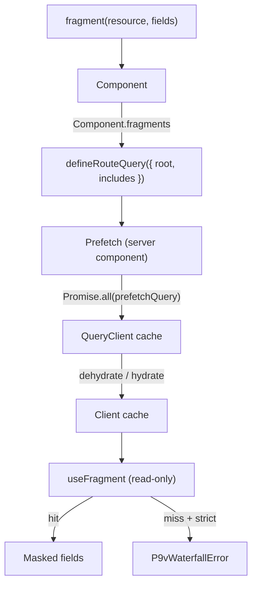

# p9v

[English](./README.md) | 한국어

**Prefetch → View.** REST + [TanStack Query](https://tanstack.com/query)를 위한 Relay 스타일 데이터 레이어로, 요청 워터폴(waterfall)을 사후에 탐지하는 데 그치지 않고 _구조적으로 불가능하게_ 만든다.

컴포넌트는 자신이 필요한 필드를 선언한다. 그러면 타입 시스템이 그 요구사항을 라우트에서 프리페치(prefetch)하도록 강제한다. 컴포넌트가 렌더링될 때 데이터가 없다면 그것이 곧 워터폴이며, p9v는 이를 조용한 클라이언트 페치 대신 눈에 띄는 에러로 바꾼다.

```tsx
// 1. Define a resource once
export const userResource = defineResource({
  name: "user",
  key: (id: string) => ["user", id] as const,
  fetch: (id) => api.get<User>(`/users/${id}`),
});

// 2. A component declares exactly what it needs (colocated)
const UserCard_user = fragment(userResource, ["id", "name", "avatarUrl"]);

function UserCard({ userId }: { userId: string }) {
  const user = useFragment(UserCard_user, userId);
  //    ^? { id: string; name: string; avatarUrl: string }
  return <div>{user.name}</div>; // reading user.email is a type error
}
UserCard.fragments = [UserCard_user] as const;

// 3. The route prefetches everything in parallel
export const userPageQuery = defineRouteQuery({
  name: "user-page",
  root: (p: { id: string }) => [userResource(p.id), statsResource(p.id)],
  includes: [UserCard, StatsPanel],
});

// app/users/[id]/page.tsx
export default async function Page({ params }) {
  const { id } = await params;
  return (
    <Prefetch query={userPageQuery} params={{ id }}>
      <UserCard userId={id} />
      <StatsPanel userId={id} />
    </Prefetch>
  );
}
```

## 왜 만들었나

**문제.** Next.js App Router + React Query 환경에서 화면을 작성하는 가장 자연스러운
방법은 각 컴포넌트가 자기 데이터를 스스로 가져오게 하는 것이다. 이렇게 하면 데이터
요구사항이 그것을 사용하는 컴포넌트와 함께 _콜로케이션(colocation)_ 되어 응집도 측면에서
좋다. 하지만 이 방식은 컴포넌트 트리의 깊이만큼 네트워크 요청을 직렬화한다. 부모가
렌더링하고 기다린 뒤에야 자식이 렌더링하고 다시 기다리고, 이런 식으로 이어진다. 결국
콜로케이션(유지보수성)과 병렬 프리페치(성능)가 정면으로 충돌한다. 모든 자식의 데이터
요구사항을 라우트 위쪽에 중복 선언하고 그것이 어긋나는 것을 지켜보거나, 아니면 워터폴을
받아들여야 한다.

**메인테이너가 직접 인정한 공백.** TanStack Query 메인테이너들은 이 문제를
[discussion #8064](https://github.com/TanStack/query/discussions/8064)에서 정확히 짚었다.

> "The main problem we are seeing with prefetching is code-dislocation. [...] without a compiler like relay, it won't be possible to extract those data requirements and trigger prefetching somewhere else automatically."
>
> (프리페치의 가장 큰 문제는 코드 분리(code-dislocation)다. [...] relay 같은 컴파일러 없이는 데이터 요구사항을 추출해 다른 곳에서 자동으로 프리페치를 트리거하는 것이 불가능하다.)

**"경고"만으로는 부족한 이유.** 기존 도구들은 워터폴을 _발생한 뒤에_ 탐지한다. 타이밍
휴리스틱이나 몽키패치된 네트워크 레이어는 요청이 발사되는 순간을 관찰하지만, 컴포넌트
트리에 대한 모델이 없다. 그래서 워터폴이 일어났다는 사실만 알려줄 뿐, 다음에 누군가
컴포넌트를 리팩터링할 때 워터폴이 다시 유입되는 것을 막지는 못한다. 탐지는 변화하는
코드베이스와 함께 조립되지 않는다.

| | 접근 방식 | 결과 |
| --- | --- | --- |
| `@bam.tech/tanstack-query-detect-waterfall` | 타이밍 휴리스틱 | **경고** (2024년부터 유지보수 중단) |
| `@fluxiapi/scan` | 네트워크 레이어 몽키패치 | **경고**, 컴포넌트 트리를 모름 |
| **p9v** | fragment + prefetch 강제 | **방지** — 워터폴이 타입/런타임 에러가 됨 |

**선택한 해법.** Relay는 수년 전 GraphQL에서 이 문제를 이미 풀었다. 페치를 마법처럼
끌어올린 것이 아니라, **타입 시스템으로 규율을 강제**하는 방식이었다. 즉 컴포넌트는
자신이 선언한 필드만 볼 수 있고, 부모는 자식의 fragment를 펼쳐 넣지 않으면 자식을
렌더링할 수 없다. p9v는 그 동일한 규율(declare / mask / enforce)을 GraphQL 없이,
빌드 스텝 없이, 코드젠 없이 REST + React Query로 이식한다. 그 효과는 측정 가능하다.
[예제 앱](./examples/next-app)에서 동일한 화면이 중첩 워터폴을 병렬 프리페치로 바꾸는
것만으로 **1202ms에서 401ms로**(3.00배) 빨라진다.

## 세 가지 규칙

1. **Declare(선언)** — 컴포넌트가 `fragment(resource, [...])`로 필요한 필드를 명시한다.
2. **Mask(마스킹)** — 그 필드만 읽을 수 있다. fragment에서 필드를 하나 지우면 그것을 조용히 사용하던 모든 지점이 드러난다. (타입 레벨은 `Pick`으로, 개발 환경 런타임은 `Proxy`로 강제.)
3. **Enforce(강제)** — `useFragment`는 절대 페치하지 않고, 프리페치된 캐시만 읽는다. 개발 환경에서 캐시 미스가 나면 React 19.1의 [owner stack](https://react.dev/reference/react/captureOwnerStack)을 통해 문제의 컴포넌트 이름을 알려주는 `P9vWaterfallError`를 던진다. 의도적인 워터폴은 `{ defer: true }`로 명시적으로 선택한다.

`useFragment`가 페치 대신 캐시를 읽기 때문에, 중첩 컴포넌트 워터폴은 몰래 끼어들 수 없다 — 데이터는 라우트에서 (병렬로) 프리페치되어 있거나, 아니면 에러다.

## 동작 방식



`<Prefetch>`는 서버에서 실행되어 라우트의 `root` 리소스를 병렬로 페치하고, 캐시를
직렬화(dehydrate)해 클라이언트로 넘긴다. 클라이언트에서 `useFragment`는 그 캐시를 오직
_읽기만_ 한다. 히트하면 선언된 필드의 마스킹된 뷰를 반환하고, strict 모드에서 미스가 나면
조용히 새 요청을 시작하는 대신 에러를 던진다.

## 결과

[예제 앱](./examples/next-app)은 동일한 화면(user + stats + posts, 엔드포인트마다 400ms)을 두 가지 방식으로 렌더링한다.

```
  vanilla (nested waterfall)   1202 ms
  p9v (parallel prefetch)       401 ms

  → p9v is 3.00x faster (801ms saved)
```

## 설치

```bash
npm install p9v @tanstack/react-query
```

`react ^18 || ^19`와 `@tanstack/react-query ^5`가 필요하다. 워터폴 에러에서
컴포넌트 이름을 친절하게 표시하는 기능은 React 19.1+의 owner stack(개발 환경 전용)을
사용한다. 그 이전 버전의 React에서도 컴포넌트 이름만 빠질 뿐 정상 동작한다.

## 시작하기

**1. 리소스 정의** — 서버 데이터 한 종류를 한 번만 선언한다.

```ts
import { defineResource } from "p9v";

export const userResource = defineResource({
  name: "user",
  key: (id: string) => ["user", id] as const,
  fetch: (id) => api.get<User>(`/users/${id}`),
});
```

**2. fragment 콜로케이션** — 각 컴포넌트가 읽을 필드를 선언한다.

```tsx
import { fragment } from "p9v";
import { useFragment } from "p9v/react";

const UserCard_user = fragment(userResource, ["id", "name", "avatarUrl"]);

export function UserCard({ userId }: { userId: string }) {
  const user = useFragment(UserCard_user, userId);
  return <span>{user.name}</span>;
}
UserCard.fragments = [UserCard_user] as const;
```

**3. 라우트 쿼리 선언** — 병렬로 프리페치할 대상을 나열한다.

```ts
import { defineRouteQuery } from "p9v";

export const userPageQuery = defineRouteQuery({
  name: "user-page",
  root: (p: { id: string }) => [userResource(p.id), statsResource(p.id)],
  includes: [UserCard, StatsPanel],
});
```

**4. 라우트에서 프리페치** — 서버 컴포넌트가 보일러플레이트를 흡수한다.

```tsx
import { Prefetch } from "p9v/server";

export default async function Page({ params }) {
  const { id } = await params;
  return (
    <Prefetch query={userPageQuery} params={{ id }}>
      <UserCard userId={id} />
      <StatsPanel userId={id} />
    </Prefetch>
  );
}
```

## 진입점(Entry points)

| Import | 실행 환경 | 내용 |
| --- | --- | --- |
| `p9v` | 서버 안전(server-safe) | `defineResource`, `fragment`, `defineRouteQuery`, `P9vWaterfallError`, `createMask`, `captureOwnerStack`, `captureOwnerName`, 타입 |
| `p9v/react` | 클라이언트 (`"use client"`) | `useFragment`, `P9vProvider`, `RouteQueryProvider` |
| `p9v/server` | 서버 | `<Prefetch>`, `getServerQueryClient` |
| `p9v/devtools` | 모든 환경 | `WaterfallRecorder`, `analyzeTimings`, `formatReport` |

React Server Component가 클라이언트 전용 코드(`createContext`, 훅)를 서버 그래프로
끌어들이지 않고도 `p9v`를 import할 수 있도록 분리했다.

## 기존 코드베이스 진단

p9v를 도입하기 전에, 지금 어디에 워터폴이 있는지 먼저 확인하자. 네트워크 탭 기반 도구와
달리 `WaterfallRecorder`는 쿼리 캐시에 붙어 동작하므로, 원본 URL이 아니라 쿼리(키,
리소스) 단위로 이해한다.

```ts
import { WaterfallRecorder } from "p9v/devtools";

const recorder = new WaterfallRecorder(queryClient).start();
// ...exercise the page, then persist recorder.toJSON() to p9v.record.json
// (or print inline with recorder.format())
```

```bash
npx p9v analyze          # reads ./p9v.record.json
```

```
[p9v] Waterfall detected — depth 2 (critical path marked ▶)
      observed 720ms  →  ~410ms if parallelized

  ▶ UserCard · user            █████████████████ 300ms
  ▶ UserPosts · team                            ███████████████████████ 410ms
```

`p9v analyze`는 워터폴이 발견되면(depth > 1) 0이 아닌 코드로 종료하므로 CI에 그대로
넣을 수 있다. 인자 없이 `p9v`를 실행하면 사용법을 볼 수 있다.

## API

### `defineResource({ name, key, fetch, staleTime?, gcTime? })`
서버 데이터 한 종류를 정의한다. 호출 가능하다: `userResource(id)`는 프리페치 가능한
인스턴스를 반환하고, `userResource.queryOptions(id)`는 TanStack의 `FetchQueryOptions`를
반환한다.

### `fragment(resource, fields, { name?, defer? })`
컴포넌트의 필드 선언이다. `defer: true`는 의도적인 워터폴을 표시한다(`useFragment`가
에러를 던지는 대신 페치/서스펜드한다).

### `useFragment(fragment, arg)` — `p9v/react`에서 제공
캐시에서 마스킹된 선언 필드를 읽는다. 반응형이며(캐시 변경 시 리렌더링) 절대 페치하지
않는다. 캐시 미스가 나면 다음과 같이 분기한다.

- **deferred fragment** → 서스펜드하며 페치한다(선택적 워터폴);
- **strict 모드** (개발 기본값) → 문제의 컴포넌트 이름과 함께 `P9vWaterfallError`를 던진다;
- **non-strict** (프로덕션 기본값) → 안전한 폴백으로 서스펜드하며 페치한다.

### `defineRouteQuery({ root, includes?, name? })`
`root(params)`는 프리페치할 리소스 인스턴스의 병렬 집합이다. `includes`는 강제 검사와
devtools를 위해 라우트의 컴포넌트를 나열한다.

### `<Prefetch query params>` — `p9v/server`에서 제공
`root`를 병렬로 프리페치하고 직렬화(dehydrate)한 뒤 클라이언트로 하이드레이트하는 서버
컴포넌트다. `getQueryClient` / `Promise.all(prefetchQuery)` / `dehydrate` /
`HydrationBoundary` 보일러플레이트를 흡수한다.

### `RouteQueryProvider` — `p9v/react`에서 제공
선택적이고 부가적인 클라이언트 프로바이더다. 활성 라우트가 어떤 리소스를 프리페치했는지
알려주어 워터폴 에러가 구체적일 수 있게 한다("route X가 Y를 프리페치하지 않음"). 데이터는
여전히 하이드레이트된 캐시에서 오며, 정확성을 위해 필수인 것은 아니다.

### `WaterfallRecorder` / `analyzeTimings` / `formatReport` — `p9v/devtools`에서 제공
`new WaterfallRecorder(queryClient).start()`는 쿼리 캐시에 붙어 페치 타이밍을 기록한다.
`recorder.analyze()`는 리포트를 반환하고, `recorder.format()`은 ASCII 타임라인을
렌더링하며, `recorder.toJSON()`은 `p9v analyze`를 위해 타이밍을 저장한다.

## Strict 모드

p9v는 기본적으로 개발 환경에서는 strict(캐시 미스 시 에러를 던짐), 프로덕션에서는
non-strict(캐시 미스 시 페치로 폴백)로 동작한다. 이 기본값은 `process.env.NODE_ENV`를
따른다. 그래서 개발할 때는 강제 검사가 시끄럽게 울리고, 배포할 때는 안전하다. 필요하면
`<P9vProvider strict={...}>`로 특정 서브트리에 대해 재정의할 수 있다.

마스킹도 같은 태도를 취한다. 필드를 보호하는 `Proxy`는 개발 환경에서만 동작한다.
프로덕션에서는 `createMask`가 원본 객체를 그대로 반환하므로, 마스킹으로 인한 런타임
오버헤드가 전혀 없다.

## 개발

```bash
pnpm install
pnpm build       # tsup으로 번들
pnpm test        # vitest 스위트 실행
pnpm typecheck   # tsc --noEmit
```

테스트는 [test/](test/)에 있으며 마스킹, 리소스, 라우트 쿼리, `useFragment`, strict
모드 동작, devtools 레코더를 다룬다. 엔드투엔드 벤치마크와 데모 실행은
[examples/next-app/README.md](examples/next-app/README.md)를 참고하자.

## 아직 미구현 (post-MVP)

- fragment 요구사항의 빌드 타임 자동 호이스팅
- 리소스의 선언 필드를 sparse fieldset(`?fields=`)으로 병합
- 리스트 리소스의 항목별(per-item) 마스킹
- 누락된 프리페치를 추가하는 코드모드(codemod)
- 정규화 캐시 / 무효화 그래프

## 라이선스

MIT
