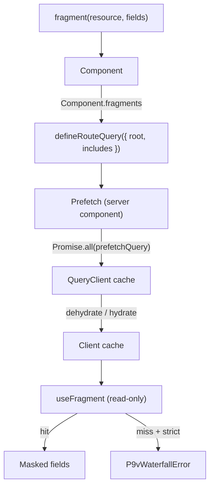

# p9v

English | [한국어](./README.ko.md)

**Prefetch → View.** A Relay-style data layer for REST + [TanStack Query](https://tanstack.com/query) that makes request waterfalls _structurally impossible_ — not just detected after the fact.

Components declare the fields they need. The type system forces those needs to be prefetched at the route. If the data isn't there when a component renders, that's a waterfall, and p9v turns it into a loud error instead of a silent client fetch.

```tsx
// 1. Define a resource once
export const userResource = defineResource({
  name: "user",
  key: (id: string) => ["user", id] as const,
  fetch: (id) => api.get<User>(`/users/${id}`),
});

// 2. A component declares exactly what it needs (colocated)
const UserCard_user = fragment(userResource, ["id", "name", "avatarUrl"]);

function UserCard({ userId }: { userId: string }) {
  const user = useFragment(UserCard_user, userId);
  //    ^? { id: string; name: string; avatarUrl: string }
  return <div>{user.name}</div>; // reading user.email is a type error
}
UserCard.fragments = [UserCard_user] as const;

// 3. The route prefetches everything in parallel
export const userPageQuery = defineRouteQuery({
  name: "user-page",
  root: (p: { id: string }) => [userResource(p.id), statsResource(p.id)],
  includes: [UserCard, StatsPanel],
});

// app/users/[id]/page.tsx
export default async function Page({ params }) {
  const { id } = await params;
  return (
    <Prefetch query={userPageQuery} params={{ id }}>
      <UserCard userId={id} />
      <StatsPanel userId={id} />
    </Prefetch>
  );
}
```

## Why this exists

**The problem.** In the Next.js App Router + React Query world, the natural way
to write a screen is to let each component fetch its own data. That keeps data
requirements _colocated_ with the component that uses them — great for cohesion —
but it serializes network requests down the depth of the component tree: the
parent renders, awaits, then the child renders and awaits, and so on. Colocation
(maintainability) and parallel prefetching (performance) end up in direct
conflict. You either duplicate every child's data requirement up at the route
(and watch it drift) or you accept a waterfall.

**The gap, in the maintainers' own words.** The TanStack Query maintainers named
this exact gap in [discussion #8064](https://github.com/TanStack/query/discussions/8064):

> "The main problem we are seeing with prefetching is code-dislocation. [...] without a compiler like relay, it won't be possible to extract those data requirements and trigger prefetching somewhere else automatically."

**Why "warn" tools aren't enough.** Existing tools detect waterfalls _after they
happen_. A timing heuristic or a monkey-patched network layer sees requests as
they fire, but it has no model of the component tree — so it can only tell you a
waterfall occurred, not prevent one from being reintroduced the next time someone
refactors a component. Detection doesn't compose with a codebase under change.

| | approach | result |
| --- | --- | --- |
| `@bam.tech/tanstack-query-detect-waterfall` | timing heuristic | **warns** (unmaintained since 2024) |
| `@fluxiapi/scan` | monkey-patches the network layer | **warns**, doesn't know the component tree |
| **p9v** | fragments + prefetch enforcement | **prevents** — a waterfall becomes a type/runtime error |

**The approach we chose.** Relay solved this for GraphQL years ago — not by
magically hoisting fetches, but by using the **type system to enforce a
discipline**: a component can only see the fields it declared, and a parent can't
render a child without spreading the child's fragment. p9v ports that same
discipline (declare / mask / enforce) to REST + React Query, with no GraphQL, no
build step, and no codegen. The payoff is measurable: in the
[example app](./examples/next-app) the same screen goes from **1202ms to 401ms**
(3.00x) just by turning a nested waterfall into a parallel prefetch.

## The three rules

1. **Declare** — a component states the fields it needs with `fragment(resource, [...])`.
2. **Mask** — it can only read those fields. Delete a field from a fragment and every place that silently used it lights up. (Type-level via `Pick`; runtime-enforced in dev via a `Proxy`.)
3. **Enforce** — `useFragment` never fetches; it only reads prefetched cache. A cache miss in dev throws a `P9vWaterfallError` that names the offending component (via React 19.1's [owner stack](https://react.dev/reference/react/captureOwnerStack)). Intentional waterfalls opt in with `{ defer: true }`.

Because `useFragment` reads the cache instead of fetching, a nested-component waterfall can't sneak in — the data is either prefetched at the route (parallel) or it's an error.

## How it works



`<Prefetch>` runs on the server, fetches the route's `root` resources in
parallel, and dehydrates the cache into the client. On the client `useFragment`
only ever _reads_ that cache: a hit returns a masked view of the declared fields;
a miss under strict mode throws instead of silently starting a new request.

## Results

The [example app](./examples/next-app) renders the same screen two ways (user + stats + posts, each endpoint 400ms):

```
  vanilla (nested waterfall)   1202 ms
  p9v (parallel prefetch)       401 ms

  → p9v is 3.00x faster (801ms saved)
```

## Install

```bash
npm install @p9v/core @tanstack/react-query
```

Requires `react ^18 || ^19` and `@tanstack/react-query ^5`. The friendly
component-naming in waterfall errors uses React 19.1+ owner stacks (dev only);
older React still works, just without the component name.

## Getting started

**1. Define a resource** — one kind of server data, declared once.

```ts
import { defineResource } from "@p9v/core";

export const userResource = defineResource({
  name: "user",
  key: (id: string) => ["user", id] as const,
  fetch: (id) => api.get<User>(`/users/${id}`),
});
```

**2. Colocate a fragment** — each component declares the fields it reads.

```tsx
import { fragment } from "@p9v/core";
import { useFragment } from "@p9v/core/react";

const UserCard_user = fragment(userResource, ["id", "name", "avatarUrl"]);

export function UserCard({ userId }: { userId: string }) {
  const user = useFragment(UserCard_user, userId);
  return <span>{user.name}</span>;
}
UserCard.fragments = [UserCard_user] as const;
```

**3. Declare the route query** — list what to prefetch in parallel.

```ts
import { defineRouteQuery } from "@p9v/core";

export const userPageQuery = defineRouteQuery({
  name: "user-page",
  root: (p: { id: string }) => [userResource(p.id), statsResource(p.id)],
  includes: [UserCard, StatsPanel],
});
```

**4. Prefetch at the route** — the server component absorbs the boilerplate.

```tsx
import { Prefetch } from "@p9v/core/server";

export default async function Page({ params }) {
  const { id } = await params;
  return (
    <Prefetch query={userPageQuery} params={{ id }}>
      <UserCard userId={id} />
      <StatsPanel userId={id} />
    </Prefetch>
  );
}
```

## Entry points

| Import | Environment | Contents |
| --- | --- | --- |
| `@p9v/core` | server-safe | `defineResource`, `fragment`, `defineRouteQuery`, `P9vWaterfallError`, `createMask`, `captureOwnerStack`, `captureOwnerName`, types |
| `@p9v/core/react` | client (`"use client"`) | `useFragment`, `P9vProvider`, `RouteQueryProvider` |
| `@p9v/core/server` | server | `<Prefetch>`, `getServerQueryClient` |
| `@p9v/core/devtools` | any | `WaterfallRecorder`, `analyzeTimings`, `formatReport` |

Split so React Server Components can import `@p9v/core` without pulling client-only
code (`createContext`, hooks) into the server graph.

## Diagnose an existing codebase

Before adopting p9v, see where your current waterfalls are. Unlike network-tab
tools, `WaterfallRecorder` hangs off the query cache, so it understands queries
(keys, resources) rather than raw URLs.

```ts
import { WaterfallRecorder } from "@p9v/core/devtools";

const recorder = new WaterfallRecorder(queryClient).start();
// ...exercise the page, then persist recorder.toJSON() to p9v.record.json
// (or print inline with recorder.format())
```

```bash
npx p9v analyze          # reads ./p9v.record.json
```

```
[p9v] Waterfall detected — depth 2 (critical path marked ▶)
      observed 720ms  →  ~410ms if parallelized

  ▶ UserCard · user            █████████████████ 300ms
  ▶ UserPosts · team                            ███████████████████████ 410ms
```

`p9v analyze` exits non-zero when a waterfall is found (depth > 1), so it drops
into CI. Run `p9v` with no arguments for usage help.

## API

### `defineResource({ name, key, fetch, staleTime?, gcTime? })`
Defines one kind of server data. Callable: `userResource(id)` returns a
prefetchable instance; `userResource.queryOptions(id)` returns TanStack
`FetchQueryOptions`.

### `fragment(resource, fields, { name?, defer? })`
A component's field declaration. `defer: true` marks an intentional waterfall
(`useFragment` will fetch/suspend instead of throwing).

### `useFragment(fragment, arg)` — from `@p9v/core/react`
Reads the masked, declared fields from the cache. Reactive (re-renders on cache
changes) but never fetches. On a cache miss it branches:

- **deferred fragment** → suspends and fetches (an opt-in waterfall);
- **strict mode** (dev default) → throws `P9vWaterfallError`, naming the offending component;
- **non-strict** (prod default) → suspends and fetches as a safe fallback.

### `defineRouteQuery({ root, includes?, name? })`
`root(params)` is the parallel set of resource instances to prefetch. `includes`
lists the route's components for enforcement and devtools.

### `<Prefetch query params>` — from `@p9v/core/server`
Server component that prefetches `root` in parallel, dehydrates, and hydrates the
client. Absorbs the `getQueryClient` / `Promise.all(prefetchQuery)` / `dehydrate`
/ `HydrationBoundary` boilerplate.

### `RouteQueryProvider` — from `@p9v/core/react`
Optional, additive client provider. It advertises which resources the active
route prefetched so a waterfall error can be specific ("route X doesn't prefetch
Y"). Data still comes from the hydrated cache; you never need it for correctness.

### `WaterfallRecorder` / `analyzeTimings` / `formatReport` — from `@p9v/core/devtools`
`new WaterfallRecorder(queryClient).start()` records fetch timings off the query
cache. `recorder.analyze()` returns a report, `recorder.format()` renders the
ASCII timeline, and `recorder.toJSON()` persists timings for `p9v analyze`.

## Strict mode

p9v is strict (a cache miss throws) in development and non-strict (a cache miss
falls back to fetching) in production by default — the default follows
`process.env.NODE_ENV`. So enforcement is loud while you build and safe when you
ship. Override it for a subtree with `<P9vProvider strict={...}>` if needed.

Masking has the same posture: the field-guarding `Proxy` runs only in
development. In production `createMask` returns the raw object, so there is zero
runtime overhead from masking.

## Development

```bash
pnpm install
pnpm build       # bundle with tsup
pnpm test        # run the vitest suite
pnpm typecheck   # tsc --noEmit
```

Tests live in [test/](test/) and cover masking, resources, route queries,
`useFragment`, strict-mode behavior, and the devtools recorder. To run the
end-to-end benchmark and demo, see [examples/next-app/README.md](examples/next-app/README.md).

## Not yet (post-MVP)

- Build-time auto-hoisting of fragment requirements
- Merging a resource's declared fields into a sparse fieldset (`?fields=`)
- Per-item masking of list resources
- Codemod to add missing prefetches
- Normalized cache / invalidation graph

## License

MIT
